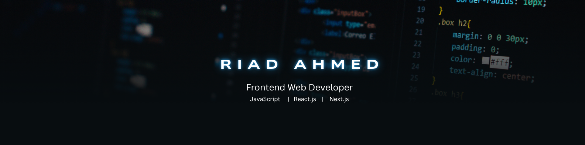

  

 

 

## 💫 About Me

 

I am a **MERN Stack Enthusiast** and a **Passionate Web Developer**. I love learning new things and exploring new technologies. I really enjoy thinking about real-life problems and finding ways to solve them through my code.

Currently, I am focusing on building **modern, scalable, and user-friendly applications** using **React.js** and **Next.js**. My goal is to create high-quality web tools that people love to use. I am always trying to improve my skills and follow the best coding practices.

 

 

## 🚀 What I'm Up To

<table border="0" cellpadding="0" cellspacing="0">
  <tr border="0">
    <td width="60%" valign="middle" style="border: none;">
      <ul>
        <li>🔭 Deep-diving into <b>Next.js</b> to build optimized web solutions.</li>
        <li>🎯 Focused on crafting <b>user-friendly, high-scalable, and modern web applications</b>.</li>
        <li>🛠️ <b>Exploring new technologies</b> to stay ahead in web development.</li>
        <li>🧩 Passionate about <b>solving real-life problems</b> through innovative coding.</li>
        <li>💡 Constantly brainstorming new project ideas.</li>
      </ul>
    </td>
    <td width="40%" align="right" valign="middle" style="border: none;">
      
    </td>
  </tr>
</table>

 

## 🔥 Languages & Frameworks & Tools 🔥

 

  

 

## 📈 Current Stats

 

  

